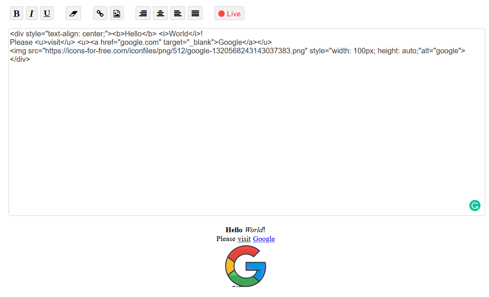
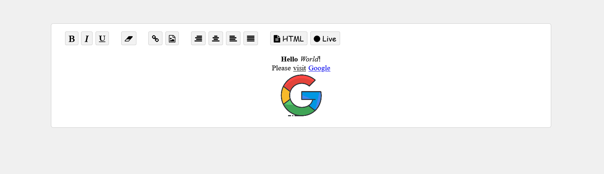

# Simple HTML editor
Edit HTML and see live result.

This is a simple editor that you can use for building web pages.




## How to use

First of all, import stylesheets and scripts in your html ```<head>```:
```html
<!-- Styles -->
<link rel="stylesheet" href="css/texteditor.min.css">
<link rel="stylesheet" href="css/fontawesome.min.css">
<link rel="stylesheet" href="css/main.min.css">

<!-- Scripts -->
<script src="js/texteditor.js"></script>
<script src="js/jquery-3.2.1.js"></script>
<script src="js/jquery-fieldselection.js"></script>
```

Then use editor needed elements where you need:
```html
<div class="hb-editor">
  
    <div id="editor-element"></div>

    <textarea id="editor" class="hb-text-editor" style="direction: ltr;"></textarea>

    <div id="editor-view-raw" style="margin: 15px; display: none;"></div>

</div>
```

Now start editor:
```js
$(document).ready(function(){

    let editor = new TextEditor(
        '#editor',
        '#editor-view-raw',
        '#editor-element'
    );

    editor.start();

});
```

## Using:
- HTML, CSS, JS
- JQuery
- Fontawesome
- Fieldselection library
